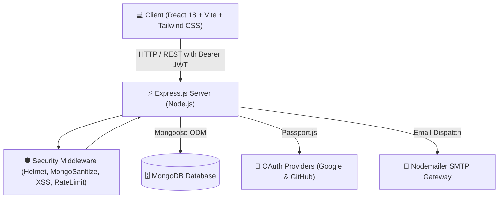

<div align="center">

  

  # 🚀 TaskoraX
  ### **Next-Gen SaaS Task, Project & Team Management Platform**

  *A modern, full-stack MERN application built with high performance, role-based workflows, dynamic analytics, and a sleek glassmorphic user interface.*

  <br />

  [](https://react.dev/)
  [](https://vitejs.dev/)
  [](https://tailwindcss.com/)
  [](https://nodejs.org/)
  [](https://expressjs.com/)
  [](https://www.mongodb.com/)
  [](https://opensource.org/licenses/MIT)

  <br />

  [Features](#-key-features) • [Architecture](#-system-architecture) • [Directory Structure](#-project-structure) • [Quick Start](#-quick-start-guide) • [Environment Config](#-environment-variables) • [API Docs](#-api-endpoints-reference) • [RBAC](#-roles--permissions-matrix) • [FAQ](#-troubleshooting--faq)

</div>

---

## 📖 Table of Contents

- [🌟 Overview](#-overview)
- [✨ Key Features](#-key-features)
- [🏗️ System Architecture](#-system-architecture)
- [📂 Project Structure](#-project-structure)
- [🚀 Quick Start Guide](#-quick-start-guide)
  - [Prerequisites](#prerequisites)
  - [1. Clone Repository](#1-clone-repository)
  - [2. Backend Setup](#2-backend-setup)
  - [3. Frontend Setup](#3-frontend-setup)
- [🔐 Environment Variables](#-environment-variables)
- [📡 API Endpoints Reference](#-api-endpoints-reference)
- [👥 Roles & Permissions Matrix](#-roles--permissions-matrix)
- [🛡️ Security Architecture](#️-security-architecture)
- [❓ Troubleshooting & FAQ](#-troubleshooting--faq)
- [📜 Useful Scripts](#-useful-scripts)
- [🤝 Contributing](#-contributing)
- [📄 License](#-license)

---

## 🌟 Overview

**TaskoraX** is an enterprise-grade, full-stack productivity ecosystem that bridges individual task management with multi-team orchestration. 

Built on the **MERN** stack (MongoDB, Express, React, Node.js), TaskoraX provides real-time workload balancing, rich interactive charts, custom project workflows, granular Role-Based Access Control (RBAC), and a responsive **Dark / Light Glassmorphism UI**.

---

## ✨ Key Features

| Module | Features & Capabilities |
| :--- | :--- |
| **📋 Task Management** | Kanban drag & drop / column views, list layouts, priority levels (`Low`, `Medium`, `High`, `Urgent`), status tracking (`To Do`, `In Progress`, `Review`, `Done`), subtasks, due dates, and custom tags. |
| **⚖️ Team Workload Board** | Real-time member capacity balancing with automatic overload warnings (`Balanced`, `Busy`, `Overloaded`), member performance scores, and 1-click CSV report export. |
| **📁 Project Hub** | Group tasks into distinct workspaces, monitor milestones, visual progress percentages, and assign multiple cross-functional teammates. |
| **📊 Visual Analytics** | Interactive charts powered by Recharts (completion velocity, priority distribution, task breakdown, and activity metrics). |
| **⚡ Activity Audit Trail** | Chronological timeline capturing status transitions, task assignments, role modifications, and project updates. |
| **🔐 Authentication & RBAC** | Stateless JWT authentication, Google OAuth 2.0, GitHub OAuth, token-based password reset via automated emails, and Role-Based Access Control (`Admin`, `Manager`, `User`). |
| **👑 Admin Control Center** | Dedicated admin console to view system statistics, manage registered users, promote/demote roles, and toggle account activation. |
| **🎨 Premium UI/UX** | Dark and Light modes, glassmorphic cards, smooth micro-animations via Framer Motion, and responsive Tailwind CSS layouts. |

---

## 🏗️ System Architecture



---

## 📂 Project Structure

```text
TaskoraX/
├── .gitignore                    # Master gitignore for root, backend, and frontend
├── README.md                     # Complete project documentation
│
├── backend/                      # Node.js + Express REST API Server
│   ├── .env.example              # Template environment variables
│   ├── package.json              # Backend dependencies & run scripts
│   ├── server.js                 # Server entry point & database connection bootstrap
│   └── src/
│       ├── app.js                # Express app setup, middleware pipeline & routing
│       ├── config/               # Database (Mongoose) & Passport OAuth configuration
│       ├── controllers/          # Business logic for Auth, Tasks, Projects, Teams, Admin
│       ├── middleware/           # JWT verification, Role authorization, Joi validator, Error handler
│       ├── models/               # Mongoose data models (User, Task, Project, ActivityLog)
│       ├── routes/               # Modular route definitions (/api/*)
│       ├── services/             # Email delivery service (Nodemailer)
│       ├── utils/                # Error handling (AppError), async wrapper, JWT generator
│       └── validations/          # Joi schemas for input validation
│
└── frontend/                     # React + Vite Single Page Application
    ├── .env.example              # Template environment variables
    ├── package.json              # Frontend dependencies & build scripts
    ├── vite.config.js            # Vite bundler configuration
    ├── tailwind.config.js        # Design tokens, color palettes & theme extensions
    ├── index.html                # HTML entry point
    └── src/
        ├── App.jsx               # Top-level routing and layout wrappers
        ├── main.jsx              # Application bootstrap & React DOM render
        ├── index.css             # Design system styles, glassmorphism tokens, scrollbars
        ├── components/           # Reusable UI component library
        │   ├── common/           # Atoms: Button, Input, Modal, Select, Badges, Loaders
        │   ├── layout/           # Sidebar, Navbar, Page Containers, Theme Switcher
        │   ├── tasks/            # Kanban Board, Task Table, Filter Bar, Task Details Modal
        │   ├── team/             # Workload Board, Performance Charts, Member Drawer, Invite Modal
        │   └── projects/         # Project Cards, Project Creation Modal
        ├── context/              # Global state (AuthContext, TaskContext, ProjectContext, TeamContext, ThemeContext)
        ├── pages/                # Views: Dashboard, Tasks, Projects, Team, Analytics, Admin, Auth pages
        └── services/             # Axios API client instance with interceptors
```

---

## 🚀 Quick Start Guide

Follow these steps to run both the backend and frontend locally in less than 3 minutes.

### Prerequisites
Make sure you have the following installed:
- [Node.js](https://nodejs.org/) (`v18.0.0` or higher)
- [npm](https://www.npmjs.com/) (`v9.0.0` or higher)
- [MongoDB](https://www.mongodb.com/) (Local MongoDB running at `mongodb://localhost:27017` or a MongoDB Atlas connection string)

---

### 1. Clone Repository

```bash
git clone https://github.com/aaryan/TaskoraX.git
cd TaskoraX
```

---

### 2. Backend Setup

1. **Navigate to the backend directory and install dependencies:**
   ```bash
   cd backend
   npm install
   ```

2. **Create your environment file from the template:**
   ```bash
   cp .env.example .env
   ```
   > *Open `.env` and verify your `MONGODB_URI` and `JWT_SECRET`.*

3. **Start the backend development server:**
   ```bash
   npm run dev
   ```
   - Server runs on: `http://localhost:5000`
   - Health check endpoint: `http://localhost:5000/api/health`

---

### 3. Frontend Setup

1. **Open a new terminal window, navigate to frontend, and install dependencies:**
   ```bash
   cd frontend
   npm install
   ```

2. **Create your frontend environment file from the template:**
   ```bash
   cp .env.example .env
   ```
   > *Defaults to `VITE_API_URL=http://localhost:5000/api`.*

3. **Start the frontend Vite development server:**
   ```bash
   npm run dev
   ```
   - Application opens on: `http://localhost:5173`

---

## 🔐 Environment Variables

### Backend Configuration (`backend/.env`)

| Variable | Description | Example / Default |
| :--- | :--- | :--- |
| `PORT` | Port number for the Express server | `5000` |
| `NODE_ENV` | Environment mode (`development` / `production`) | `development` |
| `MONGODB_URI` | MongoDB connection URI | `mongodb://127.0.0.1:27017/taskorax` |
| `JWT_SECRET` | Secret key for signing access tokens | `your_secret_access_token_key` |
| `JWT_EXPIRES_IN` | Access token lifespan | `1d` |
| `JWT_REFRESH_SECRET` | Secret key for signing refresh tokens | `your_secret_refresh_token_key` |
| `JWT_REFRESH_EXPIRES_IN` | Refresh token lifespan | `7d` |
| `FRONTEND_URL` | Allowed origin for CORS | `http://localhost:5173` |
| `EMAIL_HOST` | SMTP server host | `smtp.gmail.com` |
| `EMAIL_PORT` | SMTP port | `587` |
| `EMAIL_USERNAME` | SMTP sender email address | `user@example.com` |
| `EMAIL_PASSWORD` | SMTP app-specific password | `your_app_password` |
| `GOOGLE_CLIENT_ID` | Google OAuth Client ID *(Optional)* | `your_google_client_id` |
| `GOOGLE_CLIENT_SECRET` | Google OAuth Client Secret *(Optional)* | `your_google_client_secret` |
| `GITHUB_CLIENT_ID` | GitHub OAuth Client ID *(Optional)* | `your_github_client_id` |
| `GITHUB_CLIENT_SECRET` | GitHub OAuth Client Secret *(Optional)* | `your_github_client_secret` |

### Frontend Configuration (`frontend/.env`)

| Variable | Description | Example / Default |
| :--- | :--- | :--- |
| `VITE_API_URL` | Base endpoint URL pointing to backend API | `http://localhost:5000/api` |

---

## 📡 API Endpoints Reference

All API routes are mounted under the `/api` prefix.

### 🔑 Authentication (`/api/auth`)
| Method | Endpoint | Description | Protected |
| :--- | :--- | :--- | :---: |
| `POST` | `/auth/register` | Register a new user | ❌ |
| `POST` | `/auth/login` | Log in and receive JWT token | ❌ |
| `GET` | `/auth/me` | Fetch authenticated user profile | ✅ |
| `POST` | `/auth/forgot-password` | Send password reset email token | ❌ |
| `PUT` | `/auth/reset-password/:token` | Reset password with token | ❌ |
| `PUT` | `/auth/update-password` | Update current password | ✅ |
| `GET` | `/auth/google` | Google OAuth redirect | ❌ |
| `GET` | `/auth/github` | GitHub OAuth redirect | ❌ |

### 📌 Tasks (`/api/tasks`)
| Method | Endpoint | Description | Protected |
| :--- | :--- | :--- | :---: |
| `GET` | `/tasks` | List tasks (supports search, status filter, pagination) | ✅ |
| `POST` | `/tasks` | Create a new task | ✅ |
| `GET` | `/tasks/stats/summary` | Get aggregated task metrics | ✅ |
| `GET` | `/tasks/:id` | Get single task details | ✅ |
| `PUT` | `/tasks/:id` | Update task details | ✅ |
| `PATCH`| `/tasks/:id/status` | Quick-update task status | ✅ |
| `DELETE`| `/tasks/:id` | Delete task | ✅ |

### 📁 Projects (`/api/projects`)
| Method | Endpoint | Description | Protected |
| :--- | :--- | :--- | :---: |
| `GET` | `/projects` | Get all workspace projects | ✅ |
| `POST` | `/projects` | Create a project | ✅ |
| `GET` | `/projects/:id` | Get project details & associated tasks | ✅ |
| `PUT` | `/projects/:id` | Update project metadata | ✅ |
| `DELETE`| `/projects/:id` | Delete project | ✅ |

### 👥 Team (`/api/team`)
| Method | Endpoint | Description | Protected |
| :--- | :--- | :--- | :---: |
| `GET` | `/team/members` | Get team directory | ✅ |
| `POST` | `/team/invite` | Send invitation to new member | ✅ |
| `GET` | `/team/workload` | Get team members capacity and workload | ✅ |
| `GET` | `/team/stats` | Get team productivity scores | ✅ |

### ⚡ Activities (`/api/activities`)
| Method | Endpoint | Description | Protected |
| :--- | :--- | :--- | :---: |
| `GET` | `/activities` | Fetch recent chronological audit logs | ✅ |

### 👑 Admin (`/api/admin`)
| Method | Endpoint | Description | Required Role |
| :--- | :--- | :--- | :---: |
| `GET` | `/admin/stats` | System metrics & summary stats | `admin` |
| `GET` | `/admin/users` | List all users | `admin` |
| `POST` | `/admin/users` | Admin direct user creation | `admin` |
| `PATCH`| `/admin/users/:id/role` | Change user role (`admin`/`manager`/`user`) | `admin` |
| `PATCH`| `/admin/users/:id/status`| Toggle user active/inactive status | `admin` |

---

## 👥 Roles & Permissions Matrix

| Feature / Action | Admin / Superadmin | Manager | User (Member) |
| :--- | :---: | :---: | :---: |
| View Personal Dashboard & Tasks | ✅ | ✅ | ✅ |
| Create, Edit, & Delete Own Tasks | ✅ | ✅ | ✅ |
| View Team Workload & Directory | ✅ | ✅ | ✅ |
| Create & Manage Projects | ✅ | ✅ | ❌ |
| Assign Tasks to Team Members | ✅ | ✅ | ❌ |
| Invite New Team Members | ✅ | ✅ | ❌ |
| Access Admin Panel & System Stats | ✅ | ❌ | ❌ |
| Edit User Roles & Deactivate Accounts | ✅ | ❌ | ❌ |

---

## 🛡️ Security Architecture

TaskoraX implements industry-standard multi-layer security:
1. **Stateless JWT Authorization:** Tokens are passed via Bearer headers and validated against expiration and user status on every protected request.
2. **Password Salting & Hashing:** Passwords are hashed with `bcryptjs` before persisting to the database.
3. **NoSQL Injection Prevention:** `express-mongo-sanitize` automatically removes any illegal query operators (`$` or `.`).
4. **XSS Protection:** `xss-clean` neutralizes malicious HTML/script injections from user payloads.
5. **Secure HTTP Headers:** `helmet` sets strict CSP, HSTS, and X-Content-Type security headers.
6. **Rate Limiting:** `express-rate-limit` prevents brute-force attempts on sensitive endpoints.
7. **CORS Whitelist:** Explicit cross-origin allowance for trusted frontend origins.

---

## ❓ Troubleshooting & FAQ

<details>
<summary><b>1. Port 5000 or 5173 is already in use</b></summary>
<br>
If port 5000 is occupied, change <code>PORT=5001</code> in <code>backend/.env</code> and update <code>VITE_API_URL=http://localhost:5001/api</code> in <code>frontend/.env</code>.
</details>

<details>
<summary><b>2. MongoDB connection timeout or error</b></summary>
<br>
Ensure your local MongoDB daemon is running (<code>mongod</code> or Windows Service <code>MongoDB</code>). If using MongoDB Atlas, ensure your IP address is whitelisted under Atlas Network Access.
</details>

<details>
<summary><b>3. CORS errors when calling the API from frontend</b></summary>
<br>
Ensure <code>FRONTEND_URL=http://localhost:5173</code> in <code>backend/.env</code> matches the port where your Vite frontend is running.
</details>

---

## 📜 Useful Scripts

### Backend (`/backend`)
```bash
npm run dev     # Start development server with nodemon auto-reload
npm start       # Start production server with standard node
```

### Frontend (`/frontend`)
```bash
npm run dev     # Launch Vite dev server
npm run build   # Build production assets in /dist
npm run preview # Preview the production build locally
```

---

## 🤝 Contributing

Contributions are welcome! Follow these steps:
1. Fork the project.
2. Create your feature branch (`git checkout -b feature/AmazingFeature`).
3. Commit your changes (`git commit -m 'Add AmazingFeature'`).
4. Push to your branch (`git push origin feature/AmazingFeature`).
5. Open a Pull Request.

---

## 📄 License

This project is licensed under the **MIT License** - see the `LICENSE` file for details.

<div align="center">
  <br />
  <p>Built with ❤️ by the <b>TaskoraX Team</b></p>
</div>
